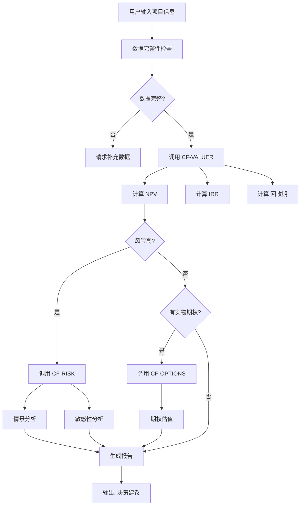
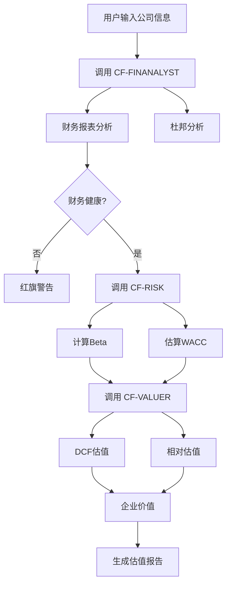
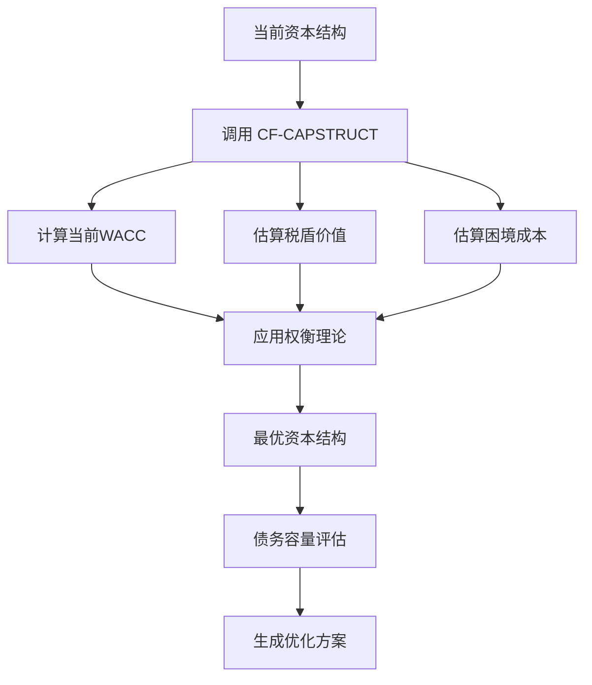

# 《公司理财》主技能规范

## 技能元数据

```yaml
skill_name: "公司理财决策系统"
skill_id: "corporate-finance-decision-system"
version: "1.0.0"
author: "Extracted from 'Corporate Finance' by Ross, Westerfield, Jordan"
domain: ["公司金融", "财务管理", "投资决策", "资本预算"]
language: ["zh", "en"]
```

---

## 技能概述

本技能系统基于《公司理财》(Corporate Finance) 第11版，提供完整的公司财务决策框架。涵盖估值、资本预算、风险分析、财务分析、资本结构和营运资本管理六大核心领域。

**核心价值主张**
- 基于证据的财务决策方法论
- 系统化的分析框架
- 可复用的MethodCards
- 专业子代理协作

---

## 技能入口点

### 主入口函数

```
corporate_finance_advisor(user_query, context_data)
```

**输入**
- `user_query`: 用户自然语言问题
- `context_data`: 可选的财务数据/背景信息

**处理流程**
```
1. 解析用户查询意图
2. 识别问题类型 (参考 03-scenario-router.md)
3. 选择主处理代理 (参考 04-subagent-playbooks.md)
4. 调用相关MethodCards (参考 02-method-catalog.md)
5. 整合分析结果
6. 生成决策建议
```

**输出**
- 结构化分析报告
- 数值计算结果
- 决策建议
- 风险提示
- 后续步骤建议

---

## 问题类型识别规则

### 自动分类器

```python
def classify_query(query: str) -> ProblemType:
    """
    基于关键词匹配的问题类型识别
    """

    # 投资决策类
    if any(kw in query for kw in ["NPV", "IRR", "投资", "项目", "资本预算"]):
        return ProblemType.CAPITAL_BUDGETING

    # 估值类
    if any(kw in query for kw in ["估值", "价值", "股价", "并购", "DCF"]):
        return ProblemType.VALUATION

    # 风险类
    if any(kw in query for kw in ["风险", "Beta", "CAPM", "WACC", "折现率"]):
        return ProblemType.RISK_ANALYSIS

    # 财务分析类
    if any(kw in query for kw in ["ROE", "财务比率", "杜邦", "报表分析"]):
        return ProblemType.FINANCIAL_ANALYSIS

    # 资本结构类
    if any(kw in query for kw in ["债务", "资本结构", "融资", "MM定理"]):
        return ProblemType.CAPITAL_STRUCTURE

    # 营运资本类
    if any(kw in query for kw in ["现金流", "营运资本", "信用政策", "存货"]):
        return ProblemType.WORKING_CAPITAL

    # 默认：综合咨询
    return ProblemType.GENERAL_CONSULTATION
```

---

## 核心工作流

### 工作流 1: 投资项目评估

**适用场景**: 评估是否投资一个项目



**输出模板**
```
## 项目评估报告

### 基本指标
- NPV: $XXX (接受/拒绝)
- IRR: XX% (高于/低于 要求回报率)
- 回收期: X年

### 风险分析
- 关键变量敏感性排序
- 情景分析结果
- 盈亏平衡点

### 战略价值
- 实物期权价值（如有）
- 战略NPV

### 建议
[具体决策建议]

### 风险提示
[主要风险及缓解措施]
```

---

### 工作流 2: 企业估值

**适用场景**: 估值一家公司



---

### 工作流 3: 资本结构优化

**适用场景**: 确定最优债务/权益比例



---

## 证据要求

### 所有输出必须包含

1. **方法论来源**: 引用《公司理财》具体章节
2. **假设说明**: 明确列出所有关键假设
3. **计算过程**: 展示关键计算步骤
4. **局限性**: 说明分析的限制条件
5. **证据引用**: 参考NotebookLM源ID

### 证据引用格式

```
[证据: Chapter X - 具体概念/公式]
[来源: NotebookLM Source ID: xxxxxx]
```

---

## 输出质量标准

### 必须满足

- [x] 每个结论都有证据支持
- [x] 数值计算展示过程
- [x] 风险提示明确
- [x] 假设条件清晰
- [x] 决策建议具体可行

### 推荐包含

- [ ] 可视化图表（现金流图、敏感性图）
- [ ] 情景对比表
- [ ] 同业对比数据
- [ ] Excel计算模板链接

---

## 子代理调度规则

### 调度优先级

| 优先级 | 代理 | 触发条件 |
|--------|------|----------|
| 1 | CF-VALUER | 任何估值/计算需求 |
| 2 | CF-RISK | 需要风险分析或资本成本 |
| 3 | CF-FINANALYST | 需要财务数据分析 |
| 4 | CF-CAPSTRUCT | 资本结构相关问题 |
| 5 | CF-WCM | 营运资本相关问题 |
| 6 | CF-OPTIONS | 存在战略灵活性/不确定性 |

### 代理组合规则

```yaml
标准估值:
  主代理: CF-VALUER
  辅助: [CF-RISK]

高风险项目:
  主代理: CF-VALUER
  辅助: [CF-RISK, CF-OPTIONS]

全面财务分析:
  主代理: CF-FINANALYST
  辅助: [CF-RISK, CF-WCM]

并购分析:
  主代理: CF-VALUER
  辅助: [CF-FINANALYST, CF-RISK, CF-CAPSTRUCT, CF-OPTIONS]
```

---

## 错误处理

### 常见错误类型

| 错误类型 | 处理方式 | 用户反馈 |
|----------|----------|----------|
| 数据不足 | 列出缺失项 + 假设默认值 | "需要以下数据，我将使用保守估计..." |
| 模型不适用 | 说明原因 + 推荐替代方法 | "标准NPV假设不适用，建议使用..." |
| 结果矛盾 | 分析原因 + 给出判断依据 | "NPV与IRR冲突，NPV优先因为..." |
| 超出范围 | 明确边界 + 建议专业咨询 | "此问题超出本skill范围，建议..." |

---

## 与其他技能的协作

### 可能协作的技能

- `financial-modeling`: 复杂财务模型构建
- `accounting-analysis`: 深度会计处理
- `market-research`: 行业/竞争对手数据
- `strategy-consulting`: 战略层面建议

### 协作接口

```yaml
输出给其他技能:
  - 估值结果
  - 风险指标
  - 财务比率
  - 预测假设

从其他技能接收:
  - 市场数据
  - 行业基准
  - 宏观经济假设
```

---

## 版本历史

| 版本 | 日期 | 变更 |
|------|------|------|
| 1.0.0 | 2026-03-15 | 初始版本，基于《公司理财》第11版 |

---

## 待改进项

- [ ] 增加更多实际案例（S&S Air, Conch Republic等）
- [ ] 添加Excel模板下载链接
- [ ] 集成实时市场数据API
- [ ] 添加可视化图表生成功能
- [ ] 扩展到第2024版新增内容

---

## 证据来源

- [1] 00-overview.md - 书籍结构与核心概念
- [2] 01-author-thinking.md - 作者思维模型
- [3] 02-method-catalog.md - 15个MethodCards
- [4] 03-scenario-router.md - 场景路由规则
- [5] 04-subagent-playbooks.md - 子代理规范
- [6] NotebookLM Notebook: b2566da4-0597-44df-87ff-fe76c81d428e

---

*文档生成时间: 2026-03-15*
*基于: 《公司理财》(Corporate Finance) 第11版*
