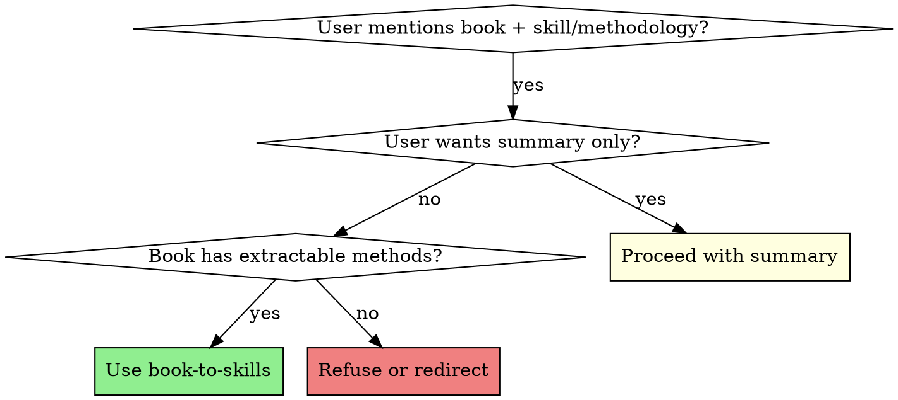

# Book to Skills

## Overview

Transform a book into reusable, evidence-based skills that an agent can actually call. This skill enforces systematic extraction—not summary generation—to produce a structured bundle including author thinking models, methodology cards, routing rules, and execution-ready Markdown outputs.

**Core principle:** Every conclusion must have evidence from the book. No guesswork, no relying on training data about the book.

## When to Use

**Use this skill when:**
- User says "帮我从《书名》生成skill"
- User wants to extract methodologies, frameworks, or thinking patterns from a book
- User needs a book-derived thinking system for agent environments
- User wants to convert book content into reusable MethodCards

**Do NOT use when:**
- User just wants a book summary or review
- User wants subjective interpretation without evidence
- The book has no clear methodology or framework

## Decision Flowchart



## Outcomes

This skill produces a structured bundle that helps an agent answer:

1. Should this book's thinking style be applied to the user's problem?
2. Which methodology modules from the book are relevant?
3. Which subagents should be assigned?
4. Which Markdown documents should be produced?

## Red Flags - STOP and Reassess

- **Thinking "I know this book"** → STOP. Use NotebookLM to query the actual content, not your training data.
- **Creating content without evidence** → STOP. Every MethodCard needs evidence references.
- **Skipping the five-stage query process** → STOP. This ensures systematic extraction.
- **Producing just a summary** → STOP. This skill creates executable skills, not summaries.

## Required Inputs

Collect or infer a minimal `BookBrief`:

```yaml
title: string
author: string
domain: string
audience: string
goal: string
language: zh | en
```

If some fields are missing, continue with reasonable assumptions and record them in the output.

## Default Workflow

### Phase 1: Setup (Sequential)
1. **Create NotebookLM notebook** for the selected book
2. **Verify source processing** before proceeding

### Phase 2: Parallel Extraction (Parallel Execution)

Execute these packs in parallel where dependencies allow:

```
┌─ Pack 1: 全书结构图 ─┐
│    (Book Profiler)   │
│         ↓            │
│   00-overview.md     │
└──────────────────────┘
                       ↘
                        ┌─ Pack 3: 方法论抽取 ─┐
                        │  (Methodology Miner) │
                        │       ↓              │
                        │   MethodCards[]      │
                        └──────────────────────┘
                       ↗                         ↘
┌─ Pack 2: 作者思维 ───┐                         ┌─ Pack 4: 场景路由 ─┐
│(Author Thinking     │                         │ (Scenario Router)  │
│     Analyst)         │                         │       ↓            │
│         ↓            │                         │ 03-scenario-router │
│ 01-author-thinking   │                         └────────────────────┘
└──────────────────────┘                                          ↘
                                                                    ↘
                        ┌─ Pack 5: 冲突校验与综合 ─────────────────────┐
                        │        (Skill Packager / QA)               │
                        │                    ↓                        │
                        │        Final Skill Bundle                   │
                        └─────────────────────────────────────────────┘
```

**Parallel Rules:**
- Pack 1 & Pack 2: Execute in parallel (no dependencies)
- Pack 3: Starts after Pack 1 AND Pack 2 complete
- Pack 4: Starts after Pack 3 completes
- Pack 5: Starts after Pack 4 completes, validates all outputs

### Phase 3: Packaging (Sequential)
6. **Assign subagents** using [references/subagent-playbooks.md](references/subagent-playbooks.md)
7. **Package into Markdown output bundle** per [references/output-schemas.md](references/output-schemas.md)
8. **Prepare infographic structure** (optional) using [references/visual-infographic-spec.md](references/visual-infographic-spec.md)

## Parallel Agent Orchestration

### Agent Dependency Graph

| Agent | Dependencies | Parallel Groups |
|-------|-------------|-----------------|
| Book Profiler | None | Group A |
| Author Thinking Analyst | None | Group A |
| Methodology Miner | Pack 1, Pack 2 outputs | Group B |
| Scenario Router | MethodCards[] | Group C |
| Skill Packager / QA | All outputs | Group D (final) |

### Execution Protocol

1. **Launch Group A agents simultaneously**
   - Both agents query NotebookLM independently
   - Outputs: `00-overview.md`, `01-author-thinking.md`

2. **Merge Group A outputs** before Group B
   - Combine book structure + author thinking model
   - Pass to Methodology Miner as unified context

3. **Group B: Methodology extraction**
   - Can split into 2 parallel sub-agents:
     - Sub-agent B1: Extract explicit methods (named frameworks)
     - Sub-agent B2: Extract implicit methods (recurring patterns)
   - Merge results into single `MethodCard[]`

4. **Group C: Routing logic**
   - Single agent, processes all MethodCards
   - Output: `03-scenario-router.md`

5. **Group D: Validation and packaging**
   - Parallel validation tasks:
     - Validate evidence completeness per MethodCard
     - Check cross-references between documents
     - Verify routing logic coverage
   - Final packaging into skill bundle

## MethodCard Schema

Every extracted method must be documented as:

```yaml
name: string              # Method name
thesis: string            # Core claim/principle
triggers:                 # When to use this method
  - string
steps:                    # Executable steps
  - string
scenarios:                # Example applications
  - string
limits:                   # When NOT to use
  - string
evidence:                 # Book evidence references
  - "Chapter X, Section Y: specific quote or reference"
assigned_agents:          # Which subagents handle this
  - string
```

## Subagent System

Use the following fixed roles:

| Role | Primary Duty | Key Output |
|------|--------------|------------|
| `Book Profiler` | Build book map, structure, core issues | `00-overview.md` |
| `Author Thinking Analyst` | Extract author's judgment patterns | `01-author-thinking.md` |
| `Methodology Miner` | Convert scattered techniques to MethodCards | `02-method-catalog.md` |
| `Scenario Router` | Map methods to problem types | `03-scenario-router.md` |
| `Skill Packager / QA` | Compile skill spec and validate evidence | `04-subagent-playbooks.md`, `05-master-skill-spec.md` |

Read [references/subagent-playbooks.md](references/subagent-playbooks.md) before assigning work.

## Output Bundle

Produce these Markdown artifacts:

- `00-overview.md` - Book goals, structure, concept map, keywords
- `01-author-thinking.md` - Author's observation patterns, judgment framework
- `02-method-catalog.md` - All MethodCards, grouped by theme
- `03-scenario-router.md` - Problem-to-method mapping and combination rules
- `04-subagent-playbooks.md` - Subagent duties, inputs, outputs, handoffs
- `05-master-skill-spec.md` - Top-level skill logic, delegation, output rules

Schemas defined in [references/output-schemas.md](references/output-schemas.md).

## Generated Skill Directory

When the extraction is materialized on disk, the final target is a standard skill directory rather than a loose `output/` folder:

- `skills/<book-slug>/SKILL.md`
- `skills/<book-slug>/workflow.yaml`
- `skills/<book-slug>/references/00-05*.md`
- `skills/<book-slug>/queries/pack-*.yaml`
- `skills/<book-slug>/logs/run-*.jsonl`

Use the lightweight runtime scripts to create this layout:

- `scripts/init_generated_skill.py`
- `scripts/wait_notebooklm.py`
- `scripts/finalize_generated_skill.py`

## Operating Rules

| Rule | Violation Consequence |
|------|----------------------|
| **Use NotebookLM MCP as primary interface** | Risk using training data instead of actual book content |
| **Use staged, purpose-built prompts** | Open-ended chat leads to inconsistent extraction |
| **Every conclusion must have evidence** | Skills drift from book content, become unreliable |
| **Weak conclusions → mark as pending** | Publishing unverified methods damages skill quality |
| **First version: single book only** | Scope creep, unfinished multi-book mess |
| **Logical parallel, actual serial execution** | Race conditions, inconsistent state |

## Common Mistakes & Fixes

| Mistake | Why It Happens | Fix |
|---------|----------------|-----|
| Relying on training data about the book | Faster than reading | Force NotebookLM query first, every time |
| Creating generic summaries | Easier than structured extraction | Follow the five-stage query packs strictly |
| Missing evidence references | Forget to record during extraction | Add evidence field to every MethodCard template |
| Weak conclusions promoted | Want to appear complete | Mark as `pending_confirmation` instead |
| Skipping subagent assignments | Simpler to do it all yourself | Use fixed role system, delegate systematically |

## Reference Guide

- **NotebookLM workflow**: [references/notebooklm-mcp-workflow.md](references/notebooklm-mcp-workflow.md)
- **Question packs**: [references/query-packs.md](references/query-packs.md)
- **Subagent contracts**: [references/subagent-playbooks.md](references/subagent-playbooks.md)
- **Output schemas**: [references/output-schemas.md](references/output-schemas.md)
- **Infographic structure**: [references/visual-infographic-spec.md](references/visual-infographic-spec.md)

## Quick Reference: Default Prompt Shape

When invoked without detailed spec, assume the user wants:

- Structured extraction of the book's thinking system
- Methodology cards with evidence
- Routing logic for real user problems
- Master skill specification for Claude Code / OpenClaw execution

**Start with:** "I'll help you convert this book into reusable skills. First, let me set up the extraction workflow..."
